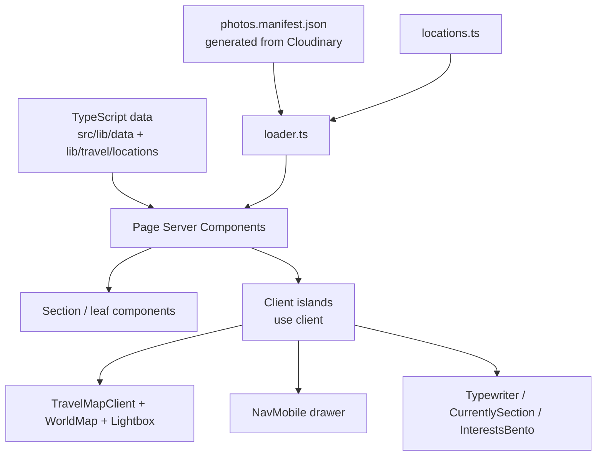

# Design Document: Portfolio Website

## Overview

Jimmy Nguyen's personal portfolio is a statically-rendered Next.js application
built with the App Router, TypeScript (strict mode), and Tailwind CSS v4. The
site has no backend, no database, and no authentication — all content is
authored as typed TypeScript data files checked into the repository. Every page
is prerendered at build time, so deployment is a static upload to Vercel with no
environment variables.

> **Revision note.** This design was updated to match the shipped site. The
> original plan had four routes (including a `/projects` page with tag
> filtering) and a static destination-card Travel page. The site shipped with
> three routes and a reimagined Travel page: an interactive SVG world map whose
> photos come from Cloudinary through a committed manifest. The Projects page
> was dropped.

The site contains three public routes plus a 404:

| Route       | Purpose                                                          |
| ----------- | ---------------------------------------------------------------- |
| `/`         | Home / landing — hero, "Currently" card, interests grid          |
| `/resume`   | Resume: professional summary, experience, skills, education      |
| `/travel`   | Interactive world map of visited locations, with photo galleries |
| `not-found` | Custom 404 for unmatched routes                                  |

### Key Design Decisions

- **Static data over CMS**: Content lives in `src/lib/` as typed TypeScript
  modules. TypeScript is the schema — a malformed entry is a build error, not a
  runtime surprise. Updating content is a direct code change.
- **Server Components with small client islands**: Every page and layout is a
  React Server Component. Interactivity is added through narrow `"use client"`
  islands (nav drawer, typewriter, "currently" ticker, interests grid, the whole
  travel map + lightbox) rather than making pages client-side.
- **ESLint flat config, native**: `eslint.config.mjs` spreads
  `eslint-config-next`'s native flat entry points (`/core-web-vitals` and
  `/typescript`) directly, rather than the legacy `FlatCompat` shim.
- **Tailwind CSS v4, CSS-first**: There is no `tailwind.config.ts`. Design
  tokens (the `brand` palette, fonts) are declared with `@theme` in
  `src/app/globals.css`. Tailwind is the sole styling mechanism — no CSS-in-JS.
- **Photos out-of-repo, indexed in-repo**: Image binaries live in Cloudinary;
  a committed JSON manifest indexes them. The app never calls Cloudinary at
  build or request time, so builds are instant and need no credentials.

---

## Architecture

### Rendering Strategy

All routes use **Static Site Generation**. `next build` prerenders each page to
static HTML (verified: the build reports every route as `○ (Static)`). There is
no `getServerSideProps`, no `revalidate`, and no request-time data fetching. The
interactive parts (map selection, lightbox, nav drawer) are client-side state
only — no network round trips.

### Directory Layout

```
JimmyNguyen/
├── public/
│   ├── Jimmy_Nguyen_Resume.pdf   # downloadable resume
│   ├── headshot.jpg
│   ├── umn.png
│   └── geo/                      # committed TopoJSON basemap layers
│       ├── countries-110m.json   # country outlines (world-atlas)
│       ├── states-10m.json       # US state borders (us-atlas)
│       └── cities-1m.json        # cities > 1M people (Natural Earth)
├── scripts/
│   └── refresh-photos.mjs        # regenerates the photo manifest from Cloudinary
├── src/
│   ├── app/
│   │   ├── layout.tsx            # root shell: header, nav, footer, cursor, analytics
│   │   ├── page.tsx             # home
│   │   ├── resume/page.tsx
│   │   ├── travel/page.tsx
│   │   ├── not-found.tsx
│   │   └── globals.css          # Tailwind v4 @theme tokens + global styles
│   ├── components/
│   │   ├── home/                # Typewriter, CurrentlySection, InterestsBento
│   │   ├── nav/                 # Nav, NavDesktop, NavMobile, NavLink
│   │   ├── resume/             # ExperienceList/Item, SkillsSection, EducationList
│   │   ├── travel/             # TravelMapClient, WorldMap, LocationPanel, Lightbox
│   │   ├── ui/                 # SectionCard, CursorDot, DownloadButton, FocusTrapper
│   │   └── Footer.tsx
│   └── lib/
│       ├── data/               # experience.ts, skills.ts, education.ts
│       ├── travel/             # locations.ts, types.ts, loader.ts, photos.manifest.json
│       └── utils/              # sort.ts (reverseChronological)
├── next.config.ts               # Cloudinary image host allow-list
├── eslint.config.mjs            # flat config extending eslint-config-next
├── tsconfig.json                # strict: true
└── package.json
```

### Data Flow



Data flows top-down from typed constants into server components. For travel,
`loadTravelLocations()` joins the hand-authored `locations.ts` with the
generated manifest and hands the page one resolved array. Client state is
limited to: the mobile nav open/close flag, the selected map location, the
lightbox index, and the home-page animation tickers. None of it fetches.

---

## Components and Interfaces

### Navigation

```
Nav (server)
├── NavDesktop (server) — hidden below md, flex row on md+
│   └── NavLink × N — usePathname() drives the active indicator
└── NavMobile (client)
    ├── Hamburger button — aria-expanded, aria-controls
    └── Drawer (portaled to <body>)
        ├── FocusTrapper — traps Tab/Shift+Tab while open
        └── NavLink × N
```

`NavLink` (`"use client"`) wraps Next.js `<Link>`, reads `usePathname()`, and
sets `aria-current="page"` plus an underline/weight change on the active route.

`NavMobile` (`"use client"`) manages `isOpen` and mounts the drawer through a
React portal to `document.body` so it escapes the sticky header's stacking
context and `backdrop-filter` containing block. It slides in over ~300ms
(mount → next animation frame → transition), traps focus via `FocusTrapper`,
locks body scroll, and closes on Escape or backdrop click. `portalReady` gates
`createPortal` so it never runs during SSR.

### Home Page Components

```
app/page.tsx (server)
├── Typewriter (client) — types the <h1>, then the bio paragraph after a delay
├── CurrentlySection (client) — vertically looping "currently" list
└── InterestsBento (client) — Framer Motion bento grid of interests
```

### Resume Page Components

```
app/resume/page.tsx (server)
├── SectionCard — Professional Summary (+ DownloadButton)
├── ExperienceList → ExperienceItem × N  (sorted by reverseChronological)
├── SkillsSection — category chips (stable hashed colors)
└── EducationList
```

`DownloadButton` (`"use client"`) links to `/Jimmy_Nguyen_Resume.pdf`.

### Travel Page Components

```
app/travel/page.tsx (server) — calls loadTravelLocations()
└── TravelMapClient (client) — owns selected-location state
    ├── WorldMap (client) — react-simple-maps SVG; pins, zoom/pan, basemap layers
    ├── quick-jump button list — keyboard-friendly parallel to the pins
    └── LocationPanel — blurb + photo grid
        └── Lightbox (client) — full-screen viewer (portal)
```

`WorldMap` renders three committed TopoJSON layers: country outlines (visited
countries filled from `visitedCountryIds`), US state borders, and >1M-population
city points that label past a zoom threshold. Zoom/pan uses
`react-zoom-pan-pinch`; selecting a location animates the projection via Framer
Motion's `animate`.

`Lightbox` renders through a portal and supports arrow/Escape keys, pinch/scroll
zoom, touch swipe, captions, and blur-up placeholders. It mounts only a window
of `{prev, current, next}` and warms the decode of neighbours, so opening a
large gallery doesn't pull every full-size image.

---

## Data Models

All models are TypeScript interfaces co-located with their data in `src/lib/`.

```typescript
// src/lib/data/experience.ts
export interface Role {
  title: string;
  startDate: string; // "YYYY-MM"
  endDate: string | "present";
  bullets: string[];
}
export interface Company {
  name: string;
  location?: string;
  roles: Role[];
}
export const experience: Company[] = [
  /* ... */
];
```

```typescript
// src/lib/data/skills.ts
export interface Skill {
  name: string;
}
export interface SkillCategory {
  label: string;
  skills: Skill[];
}
export const skillCategories: SkillCategory[] = [
  /* ... */
];
```

```typescript
// src/lib/data/education.ts
export interface Education {
  /* institution, degree, dates, ... */
}
export const education: Education[] = [
  /* ... */
];
```

```typescript
// src/lib/travel/types.ts
export interface TravelLocationMeta {
  id: string; // also the Cloudinary folder: travel/<id>
  name: string;
  region: string;
  country: string;
  coordinates: [number, number]; // [longitude, latitude] — d3-geo order
  zoom: number; // ~6 city, ~7 park
  blurb: string;
}
export interface TravelPhoto {
  id: string; // Cloudinary public ID (stable React key)
  label: string; // used for alt text + name ordering
  url: string; // ~1600px lightbox image
  thumbUrl: string; // grid thumbnail
  blurUrl: string; // tiny blurred placeholder
  caption?: string; // from Cloudinary asset Description
}
export interface TravelLocation extends TravelLocationMeta {
  photos: TravelPhoto[]; // empty ⇒ "photos coming soon"
}
```

```typescript
// src/lib/travel/loader.ts
export function loadTravelLocations(): TravelLocation[] {
  // merges locations.ts with photos.manifest.json by id
}
```

```typescript
// src/lib/utils/sort.ts
export function reverseChronological(entries: Company[]): Company[] {
  // sort key = latest endDate across a company's roles; "present" = +∞
}
```

### The photo manifest

`scripts/refresh-photos.mjs` reads the location ids straight out of
`locations.ts`, queries the Cloudinary Admin API for each `travel/<id>` folder,
and writes `src/lib/travel/photos.manifest.json`:

```json
{
  "generatedAt": "<ISO timestamp>",
  "photosByLocation": {
    "<locationId>": [
      /* TravelPhoto */
    ]
  }
}
```

The manifest is committed. `loader.ts` imports it directly, so the build has no
Cloudinary dependency. The script refuses to overwrite the manifest if every
location fails, so a rate limit can't silently blank the gallery.

---

## Styling Strategy (Tailwind v4)

Tailwind v4 uses a CSS-first config — there is no `tailwind.config.ts`. Tokens
are declared in `src/app/globals.css`:

```css
@import "tailwindcss";

@theme {
  --color-brand-50: #f0f9ff;
  --color-brand-500: #0ea5e9;
  --color-brand-700: #0369a1;
  --color-brand-900: #0c4a6e;
  /* font family variables wired to next/font (Geist) */
}
```

Brand colors are referenced both as Tailwind utilities and directly as
`var(--color-brand-700)` in inline styles (e.g. active nav links, headings).
Responsive layout uses Tailwind's default breakpoints mobile-first: single
column by default, multi-column grids at `sm`/`md`/`lg`.

---

## Error Handling

- **404** — `src/app/not-found.tsx` renders automatically for unmatched routes,
  with a message and a `<Link href="/">` home.
- **Locations without photos** — `loader.ts` yields an empty `photos` array and
  `LocationPanel` renders a "photos coming soon" state, so a pin can exist before
  its pictures are uploaded.
- **Photo refresh failures** — the refresh script logs per-location errors,
  keeps prior entries on transient failures, and aborts without writing if every
  location fails.
- **Image hosts** — `next.config.ts` allow-lists `res.cloudinary.com` scoped to
  this account's cloud name, so `next/image` accepts the delivery URLs without
  acting as an open proxy.

---

## Testing Strategy

> **Status: not implemented.** The repository includes the Vitest + jsdom +
> Testing Library + fast-check + axe-core toolchain and a `src/__tests__/setup.ts`,
> but no test files have been written yet. The section below is the intended
> plan, retained as a roadmap. The `test`/`test:watch` scripts run Vitest but
> currently match zero test files.

The intended approach pairs example-based tests with property-based tests
(via [fast-check](https://github.com/dubzzz/fast-check)):

- **Sort invariant** — `reverseChronological` orders companies by latest role
  end date, treating `"present"` as newest.
- **Manifest loader** — `loadTravelLocations()` attaches photos by id and yields
  an empty array for unknown ids.
- **Active nav link** — for each route, exactly one `NavLink` is active and
  carries `aria-current="page"`.
- **Focus trap** — Tab/Shift+Tab cycles within the open mobile drawer and never
  escapes until dismissed.
- **Lightbox windowing** — only `{prev, current, next}` layers mount for any
  index.
- **Accessibility** — axe-core scans of each rendered page report zero
  violations.

### Intended Vitest configuration

```typescript
// vitest.config.ts
import { defineConfig } from "vitest/config";
import react from "@vitejs/plugin-react";
import path from "path";

export default defineConfig({
  plugins: [react()],
  test: {
    environment: "jsdom",
    globals: true,
    setupFiles: ["./src/__tests__/setup.ts"],
  },
  resolve: { alias: { "@": path.resolve(__dirname, "./src") } },
});
```
