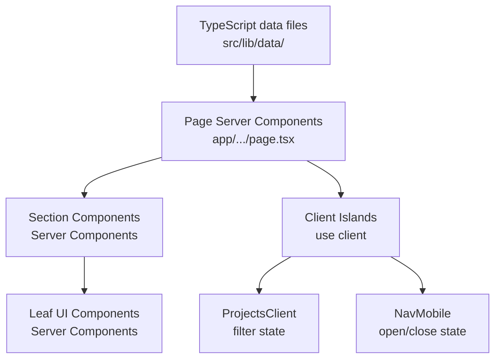
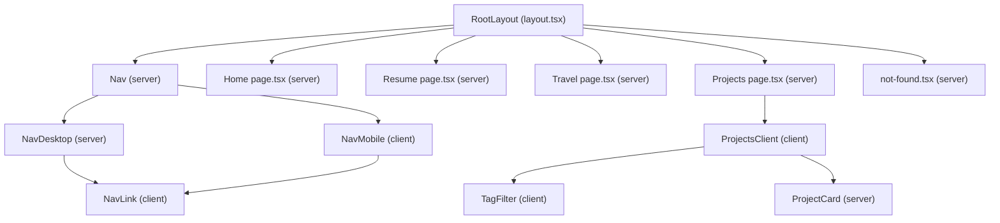

# Design Document: Portfolio Website

## Overview

Jimmy Nguyen's personal portfolio is a statically-rendered Next.js application built with the App Router, TypeScript (strict mode), and Tailwind CSS. The site has no backend, no database, and no authentication — all content is authored as typed TypeScript data files checked into the repository. Pages are rendered at build time (Static Site Generation), resulting in fast loads and trivially simple Vercel deployment.

The site contains four public routes:

| Route | Purpose |
|-------|---------|
| `/` | Home / landing page |
| `/resume` | Resume, skills, and experience |
| `/travel` | Travel destinations gallery |
| `/projects` | Projects showcase with tag filtering |

A persistent navigation bar is present on every page. A custom `not-found.tsx` handles all unmatched routes.

### Key Design Decisions

- **Static data over CMS**: Content lives in `src/lib/data/` as typed TypeScript modules. This keeps the stack simple, type-safe, and free of external dependencies. Updating content is a direct code change.
- **No CSS-in-JS**: Tailwind CSS is the sole styling mechanism, honoring Requirement 7.2. All design tokens (colors, spacing, typography scale) are defined in `tailwind.config.ts`.
- **React Server Components by default**: Every page and layout is a Server Component unless it requires client-side interactivity (`"use client"`). Only the `NavMobile` hamburger menu and the Projects tag filter need client state.
- **Next.js `Image` for every image**: Required by Requirement 6.2. The `<Image>` component provides automatic format conversion, lazy loading, and intrinsic size optimization.

---

## Architecture

### Rendering Strategy

All four pages use **Static Site Generation (SSG)** — no `getServerSideProps`, no `revalidate`. Pages are generated once at `next build` and served as static HTML from Vercel's edge CDN. The tag filter on the Projects page is purely client-side state (`useState`) — no server round trip.

### Directory Layout

```
JimmyNguyen/
├── public/
│   ├── resume.pdf              # Downloadable resume
│   ├── images/
│   │   ├── destinations/       # Travel destination photos
│   │   └── projects/           # Project screenshots (optional)
│   └── favicon.ico
├── src/
│   ├── app/
│   │   ├── layout.tsx          # Root layout (html, body, <Nav>)
│   │   ├── page.tsx            # Home / landing page
│   │   ├── not-found.tsx       # 404 page
│   │   ├── resume/
│   │   │   └── page.tsx
│   │   ├── travel/
│   │   │   └── page.tsx
│   │   └── projects/
│   │       └── page.tsx
│   └── globals.css             # Tailwind directives + CSS custom properties
├── src/
│   ├── components/
│   │   ├── nav/
│   │   │   ├── Nav.tsx         # Server component shell (renders NavDesktop + NavMobile)
│   │   │   ├── NavDesktop.tsx  # Desktop horizontal nav links
│   │   │   ├── NavMobile.tsx   # "use client" — hamburger + drawer
│   │   │   └── NavLink.tsx     # Active-state link wrapper
│   │   ├── resume/
│   │   │   ├── ExperienceList.tsx
│   │   │   ├── ExperienceItem.tsx
│   │   │   ├── SkillsSection.tsx
│   │   │   └── EducationList.tsx
│   │   ├── travel/
│   │   │   ├── DestinationGrid.tsx
│   │   │   └── DestinationCard.tsx
│   │   ├── projects/
│   │   │   ├── ProjectsClient.tsx  # "use client" — filter state
│   │   │   ├── ProjectCard.tsx
│   │   │   └── TagFilter.tsx
│   │   └── ui/
│   │       ├── DownloadButton.tsx
│   │       └── FocusTrapper.tsx    # Keyboard focus trap for mobile drawer
│   └── lib/
│       ├── data/
│       │   ├── experience.ts   # WorkExperience[]
│       │   ├── skills.ts       # SkillCategory[]
│       │   ├── education.ts    # Education[]
│       │   ├── destinations.ts # Destination[]
│       │   └── projects.ts     # Project[]
│       └── utils/
│           └── sort.ts         # reverseChronological sort helper
├── tailwind.config.ts
├── tsconfig.json               # strict: true
├── next.config.ts
├── eslint.config.mjs           # next/core-web-vitals ruleset
└── package.json
```

> Note: Next.js App Router places the `app/` directory under `src/` when the `--src-dir` flag is used. The above layout uses a single `src/` root for both `app/` and `components/`.

### Data Flow



All data flows top-down from data files into page components. The only client-side state is (a) the mobile nav open/close flag and (b) the active tag filter on the Projects page. Neither requires a network call.

---

## Components and Interfaces

### Navigation

```
Nav (server)
├── NavDesktop (server) — hidden on mobile, flex row on md+
│   └── NavLink × N — uses usePathname() for active detection
└── NavMobile (client)
    ├── HamburgerButton — aria-expanded, aria-controls
    ├── Drawer — conditionally rendered, focus-trapped
    │   └── NavLink × N
    └── FocusTrapper — traps Tab/Shift+Tab while drawer is open
```

`NavLink` wraps Next.js `<Link>` and reads `usePathname()` to apply the active visual indicator (bold weight + bottom border). Because `usePathname` is a client hook, `NavLink` is a `"use client"` component.

`NavMobile` manages a boolean `isOpen` state. A `useEffect` listening to a `resize` event auto-closes the drawer when the viewport reaches ≥768 px (Requirement 2.6). `FocusTrapper` intercepts `keydown` events to cycle focus within the drawer (Requirement 2.7).

### Resume Page Components

```
app/resume/page.tsx (server)
├── <section> — Professional Summary
├── ExperienceList (server)
│   └── ExperienceItem × N
├── SkillsSection (server)
│   └── SkillCategoryCard × N
├── EducationList (server)
│   └── EducationItem × N
└── DownloadButton — href="/resume.pdf" download attribute
```

`ExperienceList` receives `WorkExperience[]` sorted in reverse chronological order by `endDate` (or present). Sorting occurs in the page server component using the `reverseChronological` utility.

### Travel Page Components

```
app/travel/page.tsx (server)
├── <p> — Destination count (destinations.length)
└── DestinationGrid (server)
    └── DestinationCard × N
        ├── Next.js <Image> — src or placeholder
        ├── <h2> — location name
        └── <p> — description (max 300 chars enforced at data layer)
```

### Projects Page Components

```
app/projects/page.tsx (server)
└── ProjectsClient (client) — receives Project[] as prop
    ├── TagFilter — renders all unique tags; calls setActiveTag
    └── ProjectCard × N (filtered)
        ├── <h2> — project name
        ├── <p> — description
        ├── TechTags — up to 5 tags
        ├── <a> — live demo (target="_blank", rel="noopener noreferrer")
        └── <a> — repo (target="_blank", rel="noopener noreferrer")
```

The page server component passes the full `Project[]` array to `ProjectsClient` as a serializable prop. The client component holds `activeTag: string | null` in local state and computes a filtered view on each render — no `useEffect`, no fetching.

---

## Data Models

All data models are TypeScript interfaces exported from `src/lib/data/` modules. The data itself is typed constant arrays in the same files, making data + types co-located.

```typescript
// src/lib/data/experience.ts

export interface WorkExperience {
  /** Job title held at the company */
  title: string;
  company: string;
  /** ISO 8601 date string, e.g. "2021-06" */
  startDate: string;
  /** ISO 8601 date string or "present" */
  endDate: string | 'present';
  /** Markdown-free prose description of responsibilities/achievements */
  description: string;
  /** Optional: location string, e.g. "San Francisco, CA" */
  location?: string;
}

export const experience: WorkExperience[] = [
  // ...populated by Jimmy
];
```

```typescript
// src/lib/data/skills.ts

export interface Skill {
  name: string;
}

export interface SkillCategory {
  /** Category label, e.g. "Languages", "Frameworks", "Tools" */
  label: string;
  skills: Skill[];
}

export const skillCategories: SkillCategory[] = [
  // ...
];
```

```typescript
// src/lib/data/education.ts

export interface Education {
  institution: string;
  degree: string;
  /** Four-digit year, e.g. 2019 */
  graduationYear: number;
  /** Optional field of study / major */
  fieldOfStudy?: string;
}

export const education: Education[] = [
  // ...
];
```

```typescript
// src/lib/data/destinations.ts

export interface Destination {
  /** Display name of the location, e.g. "Tokyo, Japan" */
  name: string;
  /** Max 300 characters */
  description: string;
  /**
   * Path relative to /public/images/destinations/, e.g. "tokyo.jpg"
   * If null, a placeholder is rendered instead.
   */
  imagePath: string | null;
  /** Alt text for the image; required when imagePath is non-null */
  imageAlt?: string;
}

export const destinations: Destination[] = [
  // ...
];
```

```typescript
// src/lib/data/projects.ts

export interface Project {
  name: string;
  /** Max 200 characters */
  description: string;
  /** 1–5 technology tags, e.g. ["TypeScript", "Next.js", "Tailwind"] */
  tags: [string, ...string[]] & { length: 1 | 2 | 3 | 4 | 5 };
  /** Optional URL to a live demo */
  demoUrl?: string;
  /** Optional URL to source code repository */
  repoUrl?: string;
}

export const projects: Project[] = [
  // ...
];
```

```typescript
// src/lib/utils/sort.ts

import type { WorkExperience } from '../data/experience';

/**
 * Returns a new array of WorkExperience sorted reverse-chronologically.
 * "present" is treated as the highest date value.
 */
export function reverseChronological(entries: WorkExperience[]): WorkExperience[] {
  return [...entries].sort((a, b) => {
    const toMs = (d: string) => d === 'present' ? Number.MAX_SAFE_INTEGER : new Date(d).getTime();
    return toMs(b.endDate) - toMs(a.endDate);
  });
}
```

### Validation Constraints (enforced at data layer via TypeScript)

| Model | Field | Constraint |
|-------|-------|-----------|
| `Destination` | `description` | Max 300 chars — asserted in unit tests |
| `Project` | `description` | Max 200 chars — asserted in unit tests |
| `Project` | `tags` | 1–5 elements — enforced by tuple type |
| `WorkExperience` | `endDate` | `string \| 'present'` — sort utility handles both |

---

## Tailwind CSS Theming Strategy

### Configuration

`tailwind.config.ts` extends the default theme with a minimal design token set:

```typescript
// tailwind.config.ts
import type { Config } from 'tailwindcss';

const config: Config = {
  content: ['./src/**/*.{ts,tsx}'],
  theme: {
    extend: {
      colors: {
        brand: {
          50:  '#f0f9ff',
          500: '#0ea5e9',
          700: '#0369a1',
          900: '#0c4a6e',
        },
      },
      fontFamily: {
        sans: ['var(--font-geist-sans)', 'system-ui', 'sans-serif'],
        mono: ['var(--font-geist-mono)', 'monospace'],
      },
      fontSize: {
        // Fluid typography: clamp(min, preferred, max)
        body: ['clamp(0.875rem, 1.5vw, 1.25rem)', { lineHeight: '1.6' }],
      },
    },
  },
  plugins: [],
};

export default config;
```

### Fluid Typography (Requirement 2.5)

Body text uses CSS `clamp()` to scale between 14 px (0.875 rem) at narrow viewports and 20 px (1.25 rem) at wide viewports:

```css
/* globals.css */
body {
  font-size: clamp(0.875rem, 1.5vw, 1.25rem);
}
```

### Responsive Breakpoints

Tailwind's default breakpoints map directly to the requirements:

| Breakpoint | Width | Usage |
|-----------|-------|-------|
| (default) | < 640px | Mobile single-column, hamburger menu |
| `sm` | ≥ 640px | Minor layout adjustments |
| `md` | ≥ 768px | Desktop nav, multi-column grids, hide hamburger |
| `lg` | ≥ 1024px | Wider content max-width |
| `xl` | ≥ 1280px | Optional wider grid columns |

Grid classes on Travel and Projects pages: `grid grid-cols-1 md:grid-cols-2 lg:grid-cols-3 gap-6`

### Focus Styles (Requirement 6.5)

A global focus ring is applied via `globals.css` to avoid duplicating it per component:

```css
/* globals.css */
*:focus-visible {
  outline: 2px solid theme('colors.brand.500');
  outline-offset: 2px;
  border-radius: 2px;
}
```

This provides a WCAG 2.1 AA compliant 2 px solid outline on all interactive elements without disabling native focus for mouse users.

---

## Page Designs

### Home Page (`/`)

```
<header> — Full-width hero section
  <h1> — "Jimmy Nguyen"
  <p>  — Bio (≤ 300 chars)
<nav>  — Navigation (rendered by root layout, not page)
<main>
  (no additional content required; bio lives in header)
```

The landing section is a hero with the owner's name as `<h1>` and the bio as a `<p>`. The bio content is a constant string in `src/lib/data/bio.ts` (or inline in the page component).

### Resume Page (`/resume`)

```
<main>
  <section aria-labelledby="summary-heading">
    <h1 id="summary-heading">Professional Summary</h1>
    <p>...</p>
  </section>

  <section aria-labelledby="experience-heading">
    <h2 id="experience-heading">Experience</h2>
    <ExperienceList />  {/* reverse chronological */}
  </section>

  <section aria-labelledby="skills-heading">
    <h2 id="skills-heading">Skills</h2>
    <SkillsSection />   {/* category cards */}
  </section>

  <section aria-labelledby="education-heading">
    <h2 id="education-heading">Education</h2>
    <EducationList />
  </section>

  <DownloadButton href="/resume.pdf" />
</main>
```

### Travel Page (`/travel`)

```
<main>
  <header>
    <h1>Travel</h1>
    <p>{destinations.length} destinations visited</p>
  </header>
  <DestinationGrid destinations={destinations} />
    {/* grid-cols-1 md:grid-cols-2 lg:grid-cols-3 */}
</main>
```

### Projects Page (`/projects`)

```
<main>
  <h1>Projects</h1>
  <ProjectsClient projects={projects} />
    {/* client island */}
    ├── <TagFilter> — pill buttons for each unique tag
    └── project grid or "no results" message
</main>
```

### 404 Page

```
<main>
  <h1>404 – Page Not Found</h1>
  <p>The page you're looking for doesn't exist.</p>
  <Link href="/">Return home →</Link>
</main>
```

Implemented as `src/app/not-found.tsx` which Next.js App Router automatically renders for all unmatched routes.

---

## Mermaid: Component Hierarchy Overview




---

## Correctness Properties

*A property is a characteristic or behavior that should hold true across all valid executions of a system — essentially, a formal statement about what the system should do. Properties serve as the bridge between human-readable specifications and machine-verifiable correctness guarantees.*

### Property 1: Active navigation link matches current path

*For any* valid pathname in the application's route set (`/`, `/resume`, `/travel`, `/projects`), exactly one `NavLink` in the navigation should carry the active visual indicator class, and that link's `href` must equal the current pathname.

**Validates: Requirements 1.4**

---

### Property 2: No horizontal overflow at any supported viewport width

*For any* viewport width in the range [320, 2560] pixels, all page containers should have a `scrollWidth` that does not exceed their `clientWidth` — that is, no horizontal overflow is present.

**Validates: Requirements 2.4**

---

### Property 3: Fluid body font size stays within bounds

*For any* viewport width in the supported range [320, 2560] pixels, the computed `font-size` of the body element should be greater than or equal to 14 px and less than or equal to 20 px.

**Validates: Requirements 2.5**

---

### Property 4: Mobile nav drawer traps keyboard focus

*For any* open mobile navigation drawer state, pressing the Tab key repeatedly should keep focus cycling only among the focusable elements within the drawer, and focus should never move to elements outside the drawer until it is dismissed.

**Validates: Requirements 2.7**

---

### Property 5: Work experience entries are sorted reverse-chronologically

*For any* non-empty array of `WorkExperience` values passed to `reverseChronological`, the returned array should be ordered such that for every adjacent pair `(a, b)` the effective end date of `a` is greater than or equal to the effective end date of `b`. The function treats the string `"present"` as the highest possible date value.

**Validates: Requirements 3.5**

---

### Property 6: Resume data items render all required fields

*For any* `WorkExperience` entry, `SkillCategory` entry, or `Education` entry in the data arrays, the rendered component for that entry should include all required fields: `WorkExperience` must show job title, company, start date, end date, and description; `SkillCategory` must show its label and every skill name; `Education` must show institution, degree, and graduation year.

**Validates: Requirements 3.2, 3.3, 3.4**

---

### Property 7: Destination description length constraint

*For any* `Destination` in the data array, the `description` field should have a `length` of 300 characters or fewer.

**Validates: Requirements 4.1**

---

### Property 8: Destination cards render the correct image representation

*For any* `Destination`, if `imagePath` is non-null the rendered `DestinationCard` should include a Next.js `<Image>` component with an `src` derived from that path and a non-empty `alt` attribute; if `imagePath` is `null` the card should render a placeholder element and no broken-image `` tag.

**Validates: Requirements 4.2, 4.3**

---

### Property 9: Destination count equals the size of the destinations array

*For any* array of `Destination` values, the numeric count displayed above the destination collection in the Travel page should equal the length of that array.

**Validates: Requirements 4.6**

---

### Property 10: Project data satisfies field-length and tag-count constraints

*For any* `Project` in the data array, the `description` field should have a `length` of 200 characters or fewer, and the `tags` array should contain between 1 and 5 elements (inclusive). Additionally, for any `Project` with a defined `demoUrl` or `repoUrl`, the rendered `ProjectCard` should include an anchor element with the corresponding `href` and `target="_blank"`.

**Validates: Requirements 5.1, 5.2, 5.3**

---

### Property 11: Tag filter is correct and invertible

*For any* non-empty array of `Project` values and any tag string `t`: (a) filtering by `t` should return only projects where `project.tags` includes `t`; (b) if the filter is then cleared (active tag set to `null`), the full unfiltered list should be restored exactly. Projects that do not match any tag should produce an empty filtered list without error.

**Validates: Requirements 5.6, 5.7, 5.8**

---

### Property 12: Non-decorative images have non-empty alt text

*For any* rendered image that has a meaningful visual subject (i.e., it represents a destination with a non-null `imagePath`), the `alt` attribute of the corresponding `<Image>` component should be a non-empty string.

**Validates: Requirements 6.3**

---

## Error Handling

### Resume PDF Download Failure (Requirement 3.8)

The download link is a plain `<a href="/resume.pdf" download>` anchor. The browser initiates the download natively — no JavaScript fetch is involved. To handle the case where the PDF is missing:

- A `DownloadButton` client component wraps the anchor and attaches an `onError`-style fallback using a `fetch` HEAD request on first click to verify the file exists before triggering the download.
- If the HEAD request returns a non-2xx status, the component renders an inline error message: *"Resume PDF is currently unavailable. Please try again later."*
- The error state is local to the `DownloadButton` component — no global error boundary is needed.

```typescript
// Simplified DownloadButton logic
'use client';
const [error, setError] = useState(false);

async function handleClick(e: React.MouseEvent<HTMLAnchorElement>) {
  const res = await fetch('/resume.pdf', { method: 'HEAD' });
  if (!res.ok) {
    e.preventDefault();
    setError(true);
  }
}
```

### 404 Route Handling (Requirement 1.6)

Next.js App Router automatically renders `src/app/not-found.tsx` for any route that does not match a defined `page.tsx`. No additional configuration is required.

### Image Loading Failures (Travel and Projects Pages)

Next.js `<Image>` components accept an `onError` prop. `DestinationCard` uses this to swap to the placeholder when an image fails to load at runtime (complements the static `imagePath === null` check):

```typescript
<Image
  src={`/images/destinations/${destination.imagePath}`}
  alt={destination.imageAlt ?? destination.name}
  onError={() => setImgError(true)}
  ...
/>
{imgError && <PlaceholderImage />}
```

### Tag Filter Empty State (Requirement 5.7)

When the tag filter produces zero results, `ProjectsClient` renders an empty-state message instead of an empty grid:

```tsx
{filtered.length === 0 && (
  <p role="status">No projects found for &ldquo;{activeTag}&rdquo;.</p>
)}
```

The `role="status"` attribute announces the state change to screen readers without disrupting focus.

---

## Testing Strategy

### Dual Testing Approach

This project uses both **example-based unit/integration tests** and **property-based tests** for comprehensive coverage.

- **Example-based tests** verify concrete behavior: specific route rendering, layout at exact breakpoints, download link attributes, and 404 page content.
- **Property-based tests** verify universal invariants: sort correctness, filter correctness, data constraint enforcement, and field rendering completeness — all across generated inputs.

### Property-Based Testing Library

**[fast-check](https://github.com/dubzzz/fast-check)** is the chosen PBT library for TypeScript/JavaScript. It integrates with Vitest and is actively maintained with excellent TypeScript support.

```bash
npm install --save-dev fast-check vitest @testing-library/react @testing-library/user-event
```

Each property test runs a minimum of **100 iterations**. Each test is tagged with a comment referencing its design property:

```typescript
// Feature: portfolio-website, Property 5: Work experience entries are sorted reverse-chronologically
it('reverseChronological preserves ordering invariant', () => {
  fc.assert(
    fc.property(fc.array(workExperienceArb, { minLength: 1 }), (entries) => {
      const sorted = reverseChronological(entries);
      for (let i = 0; i < sorted.length - 1; i++) {
        const aMs = sorted[i].endDate === 'present' ? Infinity : new Date(sorted[i].endDate).getTime();
        const bMs = sorted[i + 1].endDate === 'present' ? Infinity : new Date(sorted[i + 1].endDate).getTime();
        expect(aMs).toBeGreaterThanOrEqual(bMs);
      }
    }),
    { numRuns: 100 }
  );
});
```

### Test Files Layout

```
src/
├── __tests__/
│   ├── unit/
│   │   ├── sort.test.ts          # Property 5: reverseChronological
│   │   ├── filter.test.ts        # Property 11: tag filter + clear
│   │   ├── data-constraints.test.ts  # Properties 7, 10: length/count invariants
│   │   └── nav-active.test.tsx   # Property 1: active link
│   ├── components/
│   │   ├── ExperienceItem.test.tsx   # Property 6: field rendering
│   │   ├── SkillsSection.test.tsx    # Property 6: field rendering
│   │   ├── EducationItem.test.tsx    # Property 6: field rendering
│   │   ├── DestinationCard.test.tsx  # Properties 8, 12: image/placeholder/alt
│   │   ├── ProjectCard.test.tsx      # Property 10: links + tags
│   │   ├── DestinationCount.test.tsx # Property 9: count equals array length
│   │   └── NavMobile.test.tsx        # Property 4: focus trap; Example: open/close
│   └── integration/
│       ├── pages.test.tsx        # Example: each page renders required sections
│       ├── overflow.test.tsx     # Property 2: no horizontal overflow
│       ├── typography.test.tsx   # Property 3: font-size in bounds
│       ├── download.test.tsx     # Example: download link; error state
│       └── a11y.test.tsx         # Example: semantic HTML, axe-core scan
```

### Test Strategy by Requirement

| Req | Criteria | Test Type | Test File |
|-----|---------|-----------|-----------|
| 1.4 | Active nav link | Property (P1) | `nav-active.test.tsx` |
| 2.4 | No horizontal overflow | Property (P2) | `overflow.test.tsx` |
| 2.5 | Fluid typography bounds | Property (P3) | `typography.test.tsx` |
| 2.7 | Focus trap in drawer | Property (P4) | `NavMobile.test.tsx` |
| 3.5 | Reverse chrono sort | Property (P5) | `sort.test.ts` |
| 3.2/3.3/3.4 | All fields rendered | Property (P6) | `ExperienceItem`, `SkillsSection`, `EducationItem` |
| 4.1 | Destination desc ≤ 300 | Property (P7) | `data-constraints.test.ts` |
| 4.2/4.3 | Correct image/placeholder | Property (P8) | `DestinationCard.test.tsx` |
| 4.6 | Destination count | Property (P9) | `DestinationCount.test.tsx` |
| 5.1/5.2/5.3 | Project constraints/links | Property (P10) | `ProjectCard.test.tsx` |
| 5.6/5.7/5.8 | Filter correct + invertible | Property (P11) | `filter.test.ts` |
| 6.3 | Alt text for images | Property (P12) | `DestinationCard.test.tsx` |
| 1.1/1.2 | Nav links present | Example | `pages.test.tsx` |
| 1.5 | Bio ≤ 300 chars | Example | `pages.test.tsx` |
| 1.6 | 404 page | Example | `pages.test.tsx` |
| 2.2/2.3 | Hamburger menu | Example | `NavMobile.test.tsx` |
| 3.6/3.7 | Download link attributes | Example | `download.test.tsx` |
| 3.8 | PDF unavailable error | Example | `download.test.tsx` |
| 6.1 | Lighthouse score | Smoke | Lighthouse CI |
| 6.4 | Semantic HTML | Example | `a11y.test.tsx` |
| 6.5/6.6/6.7 | Focus + contrast + tab | Smoke + Example | `a11y.test.tsx` |
| 7.3/7.4 | ESLint + build | Smoke | CI `next build` |

### Vitest Configuration

```typescript
// vitest.config.ts
import { defineConfig } from 'vitest/config';
import react from '@vitejs/plugin-react';
import path from 'path';

export default defineConfig({
  plugins: [react()],
  test: {
    environment: 'jsdom',
    globals: true,
    setupFiles: ['./src/__tests__/setup.ts'],
  },
  resolve: {
    alias: { '@': path.resolve(__dirname, './src') },
  },
});
```

### Unit Testing Balance

- **Property tests** handle breadth: any WorkExperience, any Destination, any Project, any tag filter combination.
- **Example tests** handle specifics: the exact download link attribute, the exact 404 message, layout at exact breakpoints.
- No unit tests are written for Tailwind class names or CSS values — those are verified by visual/integration tests against computed styles.
- Accessibility (axe-core) integration tests run on each rendered page to catch semantic HTML and contrast regressions.
